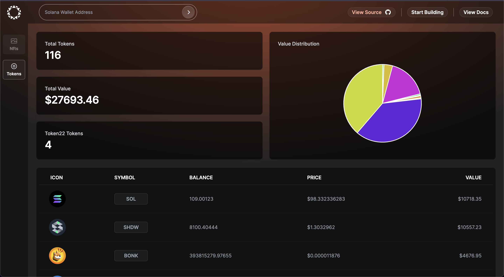

<p align="center">
    
</p>

# Galleria

Galleria is a comprehensive portfolio viewer powered by Helius's DAS API. It is designed to provide a seamless experience for viewing all your digital assets.



## Features

- Fetches and displays all tokens in a specified wallet.
- Supports both fungible and non-fungible tokens.
- Provides detailed information on specific token types such as Compressed NFTs, ProgrammableNFTs, Inscriptions, and Token Extensions (Token2022).
- Retrieves and displays token data such as token supply and token prices for fungible tokens.

## Built With

- [Next.js](https://nextjs.org/): A React framework for building modern web applications.
- [Helius's DAS API](https://docs.helius.dev/compression-and-das-api/digital-asset-standard-das-api): An API service for interacting with tokens on Solana.

## Getting Started

To get a local copy up and running, follow these simple steps:

1. Clone the repository:

```bash
git clone https://github.com/helius-labs/galleria.git
```

2. Navigate to the project directory:

```bash
cd galleria
```

3. Install the required packages:

```bash
npm i
```

4. Run the project:

```bash
npm run dev
```

Now, you should be able to see the application running on localhost:3000 (or your specified port) in your browser.

## Contributing

Galleria is an open-source project, and contributions are always welcome! If you're interested in contributing, please see our Contributing Guidelines for more information.

## License

This project is licensed under the MIT License.

## Contact

If you have any questions, issues, or suggestions, feel free to open an issue in this repository, or reach out though our Discord.
